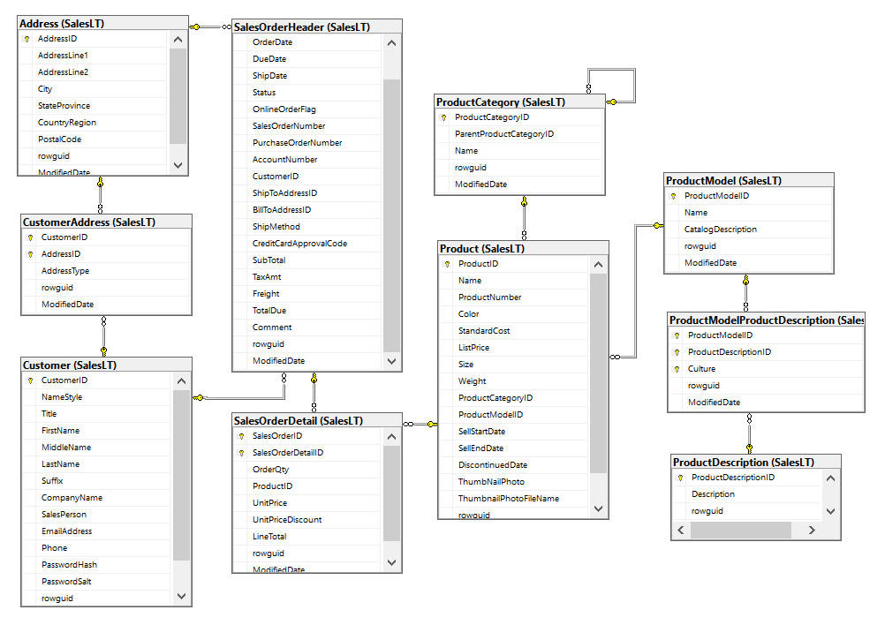
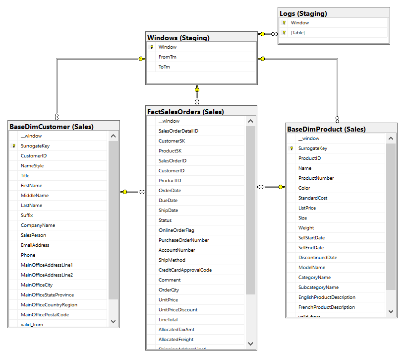
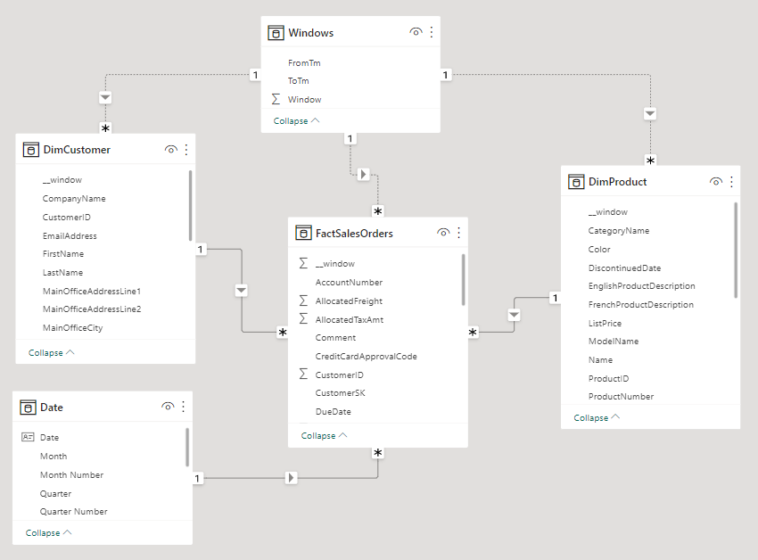
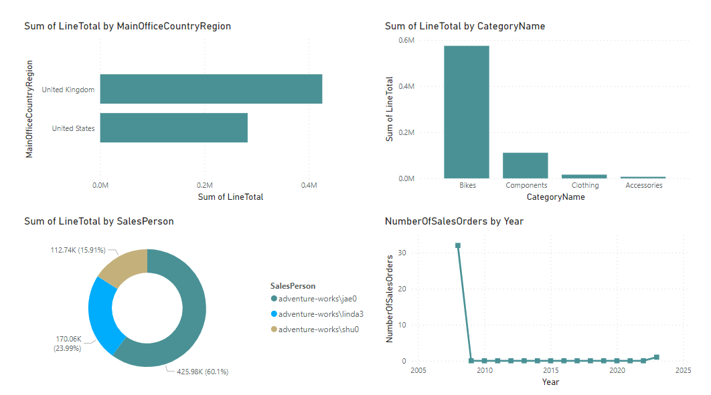

# AdventureWorksLT Data Warehouse

## Introduction

In the following project a DW for the AdventureWorksLT database is designed and implemented. The following are the high-level design characteristics:

- the source database is tracked using Change Data Capture (CDC), which allows us to capture all DML changes in the source tables
- the DW is tables are stored on an Azure SQL Database
- the ETL jobs are implemented using Scala, Spark SQL and Databricks Jobs

## Operational Database Description

The AdventureWorksLT database is a SQL Server sample database. It contains data about customers, products, and sales orders. The following image shows the schema of the operational database for which the DW is implemented.



Sales orders are placed by customers, and each order is associated with multiple products. The sales order business process goes through the following states: 

- 1 = In process
- 2 = Approved
- 3 = Backordered 
- 4 = Rejected
- 5 = Shipped
- 6 = Cancelled

Rejected, shipped and cancelled are final states in this process.

A sales order is associated with two addresses (shipping and billing). Customers have a main office address and multiple shipping addresses.


## Dimensional Model for the Sales Order Business Process

In order to facilitate analytics, a dimensional model is created for the sales orders business process. The model contains one fact tables (FactSalesOrders) and the grain is one row per sales order line item. The model contains two dimensions: DimCustomer and DimProduct. These provide the context in which a transaction took place.

### Product Dimension

The following table describes the product dimension attributes, its change tracking strategy and the tables and columns from which data provides.

| Target   Column           | Data Type     | SCD Type | Description                                         | Source Column                         |
|---------------------------|---------------|----------|-----------------------------------------------------|---------------------------------------|
| SurrogateKey              | INT           | -        | Surrogate key                                       | -                                     |
| ProductID                 | INT           | -        | Product ID                                          | Product.ProductID                     |
| Name                      | NVARCHAR(50)  | 1        | Name of the product                                 | Product.Name                          |
| ProductNumber             | NVARCHAR(25)  | 1        | Unique product identification number                | Product.ProductNumber                 |
| Color                     | NVARCHAR(15)  | 1        | Product color                                       | Product.Color                         |
| StandardCost              | MONEY         | 2        | Standard cost of the product                        | Product.StandardCost                  |
| ListPrice                 | MONEY         | 2        | Selling price                                       | Product.ListPrice                     |
| Size                      | NVARCHAR(5)   | 1        | Product size                                        | Product.Size                          |
| Weight                    | DECIMAL(8)    | 1        | Product weight                                      | Product Weight                        |
| SellStartDate             | DATETIME      | 0        | Date the product was available for   sale           | Product.SellStartDate                 |
| SellEndDate               | DATETIME      | 1        | Date the product was no longer   available for sale | Product.SellEndDate                   |
| DiscontinuedDate          | DATETIME      | 1        | Date the product was discontinued                   | Product.DiscontinuedDate              |
| ModelName                 | NVARCHAR(50)  | 1        | Product model description                           | ProductModel.Name                     |
| CategoryName              | NVARCHAR(50)  | 1        | Category description                                | ProductCategory.Name                  |
| SubcategoryName           | NVARCHAR(50)  | 1        | Subcategory description                             | ProductCategory.Name                  |
| EnglishProductDescription | NVARCHAR(400) | 1        | Description of the product model in   English       | ProductDescription.EnglishDescription |
| valid_from                | DATETIME      | -        | SCD 2 metadata                                      | -                                     |
| valid_to                  | DATETIME      | -        | SCD 2 metadata                                      | -                                     |

### Customer Dimension

The following table describes the customer dimension attributes, its change tracking strategy and the tables and columns from which data provides.

| SurrogateKey              | INT           | - | Surrogate key                                       | -                                     |
|---------------------------|---------------|---|-----------------------------------------------------|---------------------------------------|
| ProductID                 | INT           | - | Product ID                                          | Product.ProductID                     |
| Name                      | NVARCHAR(50)  | 1 | Name of the product                                 | Product.Name                          |
| ProductNumber             | NVARCHAR(25)  | 1 | Unique product identification number                | Product.ProductNumber                 |
| Color                     | NVARCHAR(15)  | 1 | Product color                                       | Product.Color                         |
| StandardCost              | MONEY         | 2 | Standard cost of the product                        | Product.StandardCost                  |
| ListPrice                 | MONEY         | 2 | Selling price                                       | Product.ListPrice                     |
| Size                      | NVARCHAR(5)   | 1 | Product size                                        | Product.Size                          |
| Weight                    | DECIMAL(8     | 1 | Product weight                                      | Product Weight                        |
| SellStartDate             | DATETIME      | 0 | Date the product was available for   sale           | Product.SellStartDate                 |
| SellEndDate               | DATETIME      | 1 | Date the product was no longer   available for sale | Product.SellEndDate                   |
| DiscontinuedDate          | DATETIME      | 1 | Date the product was discontinued                   | Product.DiscontinuedDate              |
| ModelName                 | NVARCHAR(50)  | 1 | Category description                                | ProductModel.Name                     |
| CategoryName              | NVARCHAR(50)  | 1 | Subcategory description                             | ProductCategory.Name                  |
| SubcategoryName           | NVARCHAR(50)  | 1 | Name of the product model                           | ProductCategory.Name                  |
| EnglishProductDescription | NVARCHAR(400) | 1 | Description of the product model in   English       | ProductDescription.EnglishDescription |
| valid_from                | DATETIME      | - | SCD 2 metadata                                      | -                                     |
| valid_to                  | DATETIME      | - | SCD 2 metadata                                      | -                                     |

### Sales Order Lines Fact Table

The sales orders fact table contains the sales order data. Given that sales orders follow a header-line pattern, the header-level measurements like TaxAmt and Freight have to be allocated to the line level in order to keep a consistent grain for the fact table. This is done by distributing these measurements proportionally to LineSalesAmount/HeaderSalesAmount.

The following table describes the Sales Order Lines measures and the columns from which data provides.

| Target   Column        | Data Type     | Description                                                                                                       | Source Column                             |
|------------------------|---------------|-------------------------------------------------------------------------------------------------------------------|-------------------------------------------|
| SalesOrderDetailID     | INT           | Primary key of SalesOrderHeader                                                                                   | SalesOrderDetail.SalesOrderLineID         |
| CustomerSK             | INT           | FK to the DimCustomer table   calculated using the OrderDate                                                      | -                                         |
| ProductSK              | INT           | FK to the DimProduct table   calculated using the OrderDate                                                       | -                                         |
| SalesOrderID           | INT           | SalesOrderID                                                                                                      | SalesOrderHeader.SalesOrderID             |
| CustomerID             | INT           | CustomerID                                                                                                        | SalesOrderHeader.CustomerID               |
| ProductID              | INT           | ProductID                                                                                                         | SalesOrderDetail.ProductID                |
| OrderDate              | DATETIME      | Date the sales order was created                                                                                  | SalesOrderHeader.OrderDate                |
| DueDate                | DATETIME      | Date the order is due to the   customer                                                                           | SalesOrderHeader.DueDate                  |
| ShipDate               | DATETIME      | Date the order was shipped to the   customer                                                                      | SalesOrderHeader.ShipDate                 |
| Status                 | TINYINT       | Order current status. 1 = In   process; 2 = Approved; 3 = Backordered; 4 = Rejected; 5 = Shipped; 6 =   Cancelled | SalesOrderHeader.Status                   |
| OnlineOrderFlag        | BIT           | False = Order placed by sales   person. true = Order placed online by customer                                    | SalesOrderHeader.OnlineOrderFlag          |
| PurchaseOrderNumber    | NVARCHAR(25)  | Customer purchase order number   reference                                                                        | SalesOrderHeader.PurchaseOrderNumber      |
| AccountNumber          | NVARCHAR(15)  | Financial accounting number   reference                                                                           | SalesOrderHeader.AccountNumber            |
| ShipMethod             | NVARCHAR(50)  | Shipping method                                                                                                   | SalesOrderHeader.ShipMethod               |
| CreditCardApprovalCode | VARCHAR(15)   | Approval code provided by the credit   card company                                                               | SalesOrderHeader.CreditCardApprovalCode   |
| Comment                | NVARCHAR(MAX) | Sales representative comments                                                                                     | SalesOrderHeader.Comment                  |
| OrderQty               | SMALLINT      | Quantity ordered per product                                                                                      | SalesOrderDetail.OrderQuantity            |
| UnitPrice              | MONEY         | Selling price of a single product                                                                                 | SalesOrderDetail.UnitPrice                |
| UnitPriceDiscount      | MONEY         | Discount amount (%)                                                                                               | SalesOrderDetail.UnitPriceDiscount        |
| LineTotal              | MONEY         | Per product subtotal. Computed as   UnitPrice * (1 - UnitPriceDiscount) * OrderQty                                | =UnitPrice*(1-UnitPriceDiscount)*OrderQty |
| AllocatedTaxAmt        | MONEY         | Tax amount allocated based on the   percentage the line total represents of the order total                       | SalesOrderHeader.TaxAmt   ALLOCATED …     |
| AllocatedFreight       | MONEY         | Shipping cost allocated based on the   percentage the line total represents of the order total                    | SalesOrderHeader.Freight   ALLOCATED …    |
| ShippingAddressLine1   | NVARCHAR(60)  | First street address line of the   shipping office                                                                | Address.AddressLine1                      |
| ShippingAddressLine2   | NVARCHAR(60)  | Second street address line of the   shipping office                                                               | Address.AddressLine2                      |
| ShippingCity           | NVARCHAR(30)  | Postal code for the street address   line of the shipping office                                                  | Address.City                              |
| ShippingStateProvince  | NVARCHAR(50)  | Name of the city of the shipping   office                                                                         | Address.StateProvince                     |
| ShippingCountryRegion  | NVARCHAR(50)  | Name of the state of the shipping   office                                                                        | Address.CountryRegion                     |
| ShippingPostalCode     | NVARCHAR(15)  | Name of the country of the shipping   office                                                                      | Address.PostalCode                        |


## Data Warehouse and Data Integration Jobs Description

The following image shows the data warehouse database schema:



The ETL jobs are executed periodically and load the DW incrementally. For each execution of the ETL jobs a new Window table record is created:
- retrieve the most current window information: (window_number, window_start)
- retrieve the timestamp of the current LSN number in the source database (window_end)
- create a new row in the Windows table: (window_number+1, window_start, window_end) 

To construct the dimension tables, CDC is activated on the source tables. CDC is an SQL Server feature that allows the recording of DML operations on a table. The CDC records are loaded incrementally into the DW and are used to incrementally construct the base dimension tables in the following way:

- retrieve the window_start and window_end of the current window
- extract the CDC records for the interval \(window_start, window_end\]
- for each CDC table, build a temporal table for the interval \(window_start, window_end\]
- denormalize the temporal tables 
- load the new records into the base dimension table

The BaseDimCustomer and BaseDimCustomer tables contain the entire history of changes for the dimensional entities. These tables are used to implement the dimensions described in section 3 using a view:

```
CREATE VIEW [Sales].[DimProduct]
AS 
SELECT 

  [SurrogateKey], 
  [ProductID], 

  -- SCD 0 columns
  FIRST_VALUE(SellStartDate)   OVER (PARTITION BY ProductID ORDER BY valid_from) as SellStartDate,

  -- SCD 1 columns
  LAST_VALUE(Name)             OVER (PARTITION BY ProductID ORDER BY valid_from) as Name,
  LAST_VALUE(ProductNumber)    OVER (PARTITION BY ProductID ORDER BY valid_from) as ProductNumber,
  LAST_VALUE(Color)            OVER (PARTITION BY ProductID ORDER BY valid_from) as Color,
  LAST_VALUE(Size)             OVER (PARTITION BY ProductID ORDER BY valid_from) as Size,
  LAST_VALUE(Weight)           OVER (PARTITION BY ProductID ORDER BY valid_from) as Weight,
  LAST_VALUE(SellEndDate)      OVER (PARTITION BY ProductID ORDER BY valid_from) as SellEndDate,
  LAST_VALUE(DiscontinuedDate) OVER (PARTITION BY ProductID ORDER BY valid_from) as DiscontinuedDate,
  LAST_VALUE(ModelName)        OVER (PARTITION BY ProductID ORDER BY valid_from) as ModelName,
  LAST_VALUE(CategoryName)     OVER (PARTITION BY ProductID ORDER BY valid_from) as CategoryName,
  LAST_VALUE(SubcategoryName)  OVER (PARTITION BY ProductID ORDER BY valid_from) as SubcategoryName,
  LAST_VALUE(EnglishProductDescription) OVER (PARTITION BY ProductID ORDER BY valid_from) as EnglishProductDescription,

  -- SCD 2 columns
  [StandardCost], 
  [ListPrice]

  [valid_from], 
  [valid_to]

FROM [Sales].[BaseDimProduct];
```


```
CREATE VIEW [Sales].[DimCustomer]
AS 
SELECT 

  [SurrogateKey], 
  [CustomerID], 

  -- SCD 0 columns
  FIRST_VALUE(CompanyName) OVER (PARTITION BY CustomerID ORDER BY valid_from) as OriginalCompanyName,

  -- SCD 1 columns
  LAST_VALUE(NameStyle)    OVER (PARTITION BY CustomerID ORDER BY valid_from) as CurrentNameStyle,
  LAST_VALUE(Title)        OVER (PARTITION BY CustomerID ORDER BY valid_from) as CurrentTitle,
  LAST_VALUE(FirstName)    OVER (PARTITION BY CustomerID ORDER BY valid_from) as CurrentFirstName,
  LAST_VALUE(MiddleName)   OVER (PARTITION BY CustomerID ORDER BY valid_from) as CurrentMiddleName,
  LAST_VALUE(LastName)     OVER (PARTITION BY CustomerID ORDER BY valid_from) as CurrentLastName,
  LAST_VALUE(Suffix)       OVER (PARTITION BY CustomerID ORDER BY valid_from) as CurrentSuffix,
  LAST_VALUE(CompanyName)  OVER (PARTITION BY CustomerID ORDER BY valid_from) as CurrentCompanyName,
  LAST_VALUE(EmailAddress) OVER (PARTITION BY CustomerID ORDER BY valid_from) as CurrentEmailAddress,
  LAST_VALUE(Phone)        OVER (PARTITION BY CustomerID ORDER BY valid_from) as CurrentPhone,

  -- SCD 2 columns
  [SalesPerson], 
  [MainOfficeAddressLine1], 
  [MainOfficeAddressLine2], 
  [MainOfficeCity], 
  [MainOfficeStateProvince], 
  [MainOfficeCountryRegion], 
  [MainOfficePostalCode], 

  [valid_from], 
  [valid_to]

FROM [Sales].[BaseDimCustomer];
```

This approach to building a dimension table gives us the following benefits:
- The entire history of changes is kept, there is no data loss.
- the dimensions are built by only appending data, which increases the speed of the ETL jobs.
- The dimensions are flexible in the type of SCD strategy, which allows the analysts to fit their data to their needs:
  - SCD 0: keep the original value
  - SCD 1: keep the most current value
  - SCD 2: keep the history of changes
  - SCD 3: keep the value fixed at a particular point in time.

The sales orders are loaded incrementally by partitioning them using the due date column:
- retrieve the window_start and window_end of the current window
- extract the sales orders such that DueDate in \(window_start, window_end\]
- load the new records into the fact table
- perform the dimensions surrogate key lookup

## Sample Power BI Report

The powerbi/AdventureWorksDW-SalesOrdersReport.pbix PBI report contains the DW data and can be used to inspect the ETL jobs.





## Repository Description

The contents of the repository are described in this section:

- **azdevops/pipelines**: Azure DevOps pipelines to deploy the DW libraries and jobs to the production Databricks workspace
- **azdevops/service-connections**: templates for constructing Azure DevOps service connections
- **azdevops/utilities.ps1**: Azure Devops CLI utility functions.
- **databricks/clusters**: templates for creating Databricks clusters.
- **databricks/instance-pools**: templates for creating Databricks instance pools.
- **databricks/jobs**: templates for creating Databricks jobs.
- **databricks/libraries/advworkslt**: Scala library that implements the ETL jobs.
- **databricks/utilities.ps1**: Databricks CLI utility functions.
- **powerbi/AdventureWorksLT-SalesOrdersReport.pbix**: The pbix file to inspect the DW tables.
- **sql-database/projects/AdventureWorksDW**: SQL Database project for deploying the OLAP SQL Database.
- **sql-database/bacpacs/AdvWorksLT.bacpac**: bacpacs to deploy the OLTP SQL Database.
- **sql-database/scripts/cdc-setup.sql**: SQL script that activates CDC on the OLTP SQL Database.
- **sql-database/scripts/trans**: SQL scripts that contain DML statements to simulate the operations of the operational database and test the ETL jobs.
- **main.ipynb**: PS notebook that deploys the Azure resources, simulates the DB and DW operations day by day, and inspects the results of the ETL jobs. To run the notebook you can use the VSCode .NET interactive extension or install the powershell_kernel Python package.
